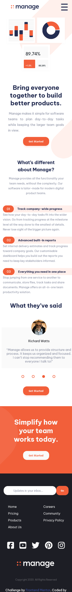
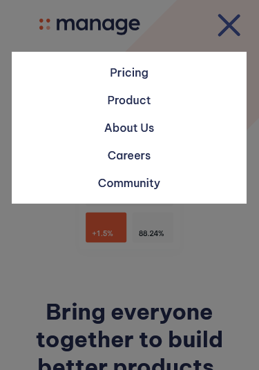
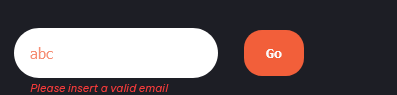
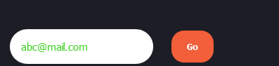

# Frontend Mentor - Manage landing page solution

- This is a solution to the [Manage landing page challenge on Frontend Mentor](https://www.frontendmentor.io/challenges/manage-landing-page-SLXqC6P5). Frontend Mentor challenges help you improve your coding skills by building realistic projects. 
  
  
- Desafio proposto pelo curso [Descodificadas](https://moodle.descodificadas.com.br) - Trilha 3

## Table of contents

- [Overview](#overview)
  - [The challenge](#the-challenge)
  - [Screenshot](#screenshot)
- [My process](#my-process)
  - [Built with](#built-with)
  - [What I learned](#what-i-learned)
  - [Continued development](#continued-development)
  - [Useful resources](#useful-resources)
- [Author](#author)
- [Acknowledgments](#acknowledgments)

## Overview

### The challenge 

#### <b>Português</b>
Os usuários devem ser capazes de:

- Visualizar o layout ideal do site dependendo do tamanho da tela do dispositivo
- Visualizar os estados de hover(foco) para todos os elementos interativos na página
- Visualizar todos os depoimentos em um controle deslizante horizontal
- Receber uma mensagem de erro quando o `formulário` de inscrição na newsletter for enviado se:
  - O campo `input` está vazio
  - O endereço de e-mail não está formatado corretamente

#### <b>English</b>
Users should be able to:

- View the optimal layout for the site depending on their device's screen size
- See hover states for all interactive elements on the page
- See all testimonials in a horizontal slider
- Receive an error message when the newsletter sign up `form` is submitted if:
  - The `input` field is empty
  - The email address is not formatted correctly

### Screenshot

  

  

  

  

## My process

### Built with

- Semantic HTML5 markup
- CSS custom properties
- Flexbox
- CSS Grid
- JavaScript

### What I learned

- Uso de :before
- Criar caixas modal com background
- Alterar cor do svg através tanto do figma como VsCode
- Manipulação do background com do background-position e background-size

### Continued development

- Aprender melhor como fazer slider em diferentes dispositivos
- Manipulação de arquivos svg
- Desenvolvimento responsivo
- Pseudo-elementos e classe
- Positions

### Useful resources

- [Figma](https://www.figma.com/) - Alterar a cor do logo para o rodapé e manter em svg. 
- [Fontawesome](https://www.example.com) - Ícones para as redes sociais e assim poder escolher cor da fonte e hover.
- [MDN Web Docs](https://developer.mozilla.org/pt-BR/docs/Web/CSS) - Documentação do CSS usada para verificar propriedades

## Author

- Website - [Jessica Ferraz](https://github.com/ferrazjaa)
- Frontend Mentor - [@ferrazjaa](https://www.frontendmentor.io/profile/ferrazjaa)

## Acknowledgments

- Slide versão dispositivos mobile [Criando Slider com HTML, CSS e JavaScript](https://www.youtube.com/watch?v=BpzyuuPIEaQ) de [Sujeito Programador](https://www.youtube.com/@Sujeitoprogramador)

- Slide versão dispositivos maiores adaptado de: [Automatic Image Slider in HTML and CSS only](https://www.thecoderashok.com/blog/automatic-image-slider-in-html-css-only#google_vignette)

- [Background-position - MDN](https://developer.mozilla.org/en-US/docs/Web/CSS/background-position)

- Menu hamburger adaptado de [Menu Hamburger Completo (só com CSS e técnica esquisita)](https://www.youtube.com/watch?v=n-bkT-R5E_4)

- [Escurecer o segundo plano ao abrir janela div modal](https://pt.stackoverflow.com/questions/133952/escurecer-o-segundo-plano-ao-abrir-janela-div-modal)

- [::before](https://developer.mozilla.org/pt-BR/docs/Web/CSS/::before)